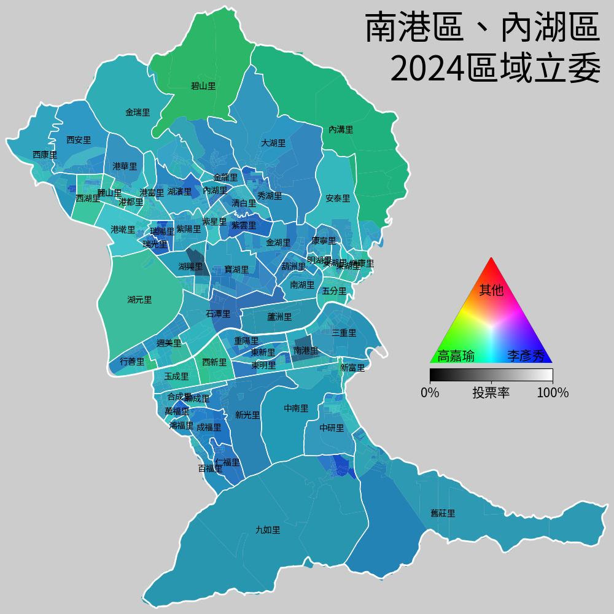
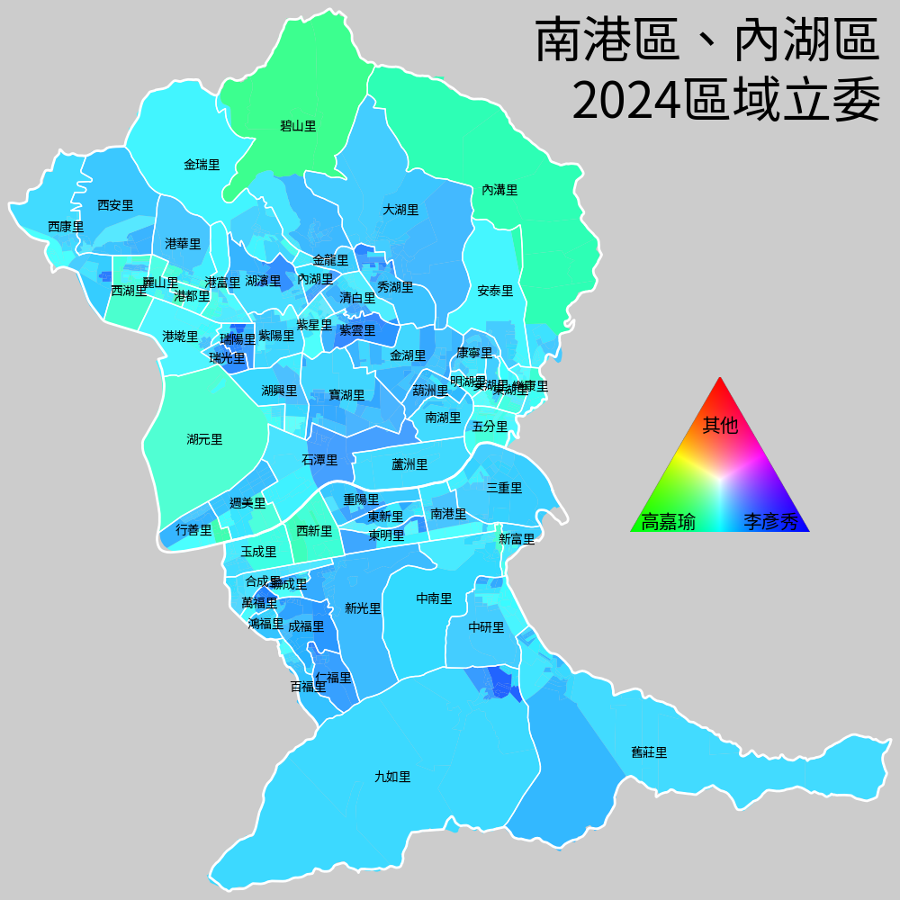

# VisualVoteData
Visualize vote data from the Central Election Commission of Taiwan

|  |  |
| -------------------- | ----------------------------- |

## Usage

1. Convert SHP files into Python pickles, if they are not already in `shapes/`.
   ```sh
   > cd collect_shapes
   > <python> collect_shapes.py 臺北市 南港區
   > <python> collect_shapes.py 臺北市 內湖區
   ```

2. Distill data from [選舉資料庫](https://data.cec.gov.tw/選舉資料庫/votedata.zip), if they are not already in `data/`.
   ```sh
   > cd distill_data
   > <python> distill_legislators.py 臺北市 南港區
   > <python> distill_legislators.py 臺北市 內湖區
   ```

3. Select what values to visualize with `select_data.py` or with something like Google Sheets.
   Intermediate CSV files will be generated in `visualize/rgb/`.
   ```sh
   > cd visualize
   > <python> select_data.py ../data/臺北市_南港區_立委第4選區_投開票所.csv --out=南港
   > <python> select_data.py ../data/臺北市_內湖區_立委第4選區_投開票所.csv --out=內湖
   ```

4. Export to images (TODO: interactive webpages, and KML files for Google Earth).
   ```sh
   > cd visualize
   > <python> export.py ../output/港湖 南港 內湖
   ```

## Data sources

* [選舉資料庫](https://data.cec.gov.tw/選舉資料庫/votedata.zip)

  * It seems that `elbese.csv` is for elections with electoral districts, while `elbase.csv` is for elections **without** electoral districts (`ECODE == 0` for all rows).
    ```sh
    # 臺北市: province code: 63
    # 臺北市: county code: 0
    # 松山區: town code: 10
    # 全區合計: village code: '0000'
    
    # elbese.csv:
    >>> df[(df.PCODE==63) & (df.CCODE==0) & (df.TCODE==10) & (df.VCODE=='0000')]
          PCODE  CCODE  ECODE  TCODE VCODE NAME
    457      63      0      3     10  0000  松山區
    458      63      0      7     10  0000  松山區
    
    # elbase.csv:
    >>> df[(df.PCODE==63) & (df.CCODE==0) & (df.TCODE==10) & (df.VCODE=='0000')]
          PCODE  CCODE  ECODE  TCODE VCODE NAME
    1        63      0      0     10  0000  松山區
    ```

    These rows are only present in `elbese.csv`:
    ```sh
    >>> df[(df.ECODE!=0) & (df.TCODE==0) & (df.VCODE=='0000')]
          PCODE  CCODE  ECODE  TCODE VCODE      NAME
    472      63      0      1      0  0000  臺北市第01選區
    473      63      0      2      0  0000  臺北市第02選區
    474      63      0      3      0  0000  臺北市第03選區
    475      63      0      4      0  0000  臺北市第04選區
    476      63      0      5      0  0000  臺北市第05選區
    ...     ...    ...    ...    ...   ...       ...
    8263     10     17      1      0  0000  基隆市第01選區
    8264     10     18      1      0  0000  新竹市第01選區
    8265     10     20      1      0  0000  嘉義市第01選區
    8352      9      7      1      0  0000  連江縣第01選區
    8353      9     20      1      0  0000  金門縣第01選區
    
    [73 rows x 6 columns]
    ```

* [鄉鎮市區界線(TWD97經緯度)](https://data.gov.tw/dataset/7441)

* [村里界歷史圖資(TWD97經緯度)](https://data.gov.tw/dataset/130549)

* [臺北市鄰界圖](https://data.gov.tw/dataset/121424)
  * Converted the TM2 (2-degree zone transverse Mercator) coordinates to longitudes and latitudes with [ShpTrans 2.2 by 范成棟 (2006.03.15)](https://gis.rchss.sinica.edu.tw/ISTIS/tools/)

## Font

* [Noto Sans Traditional Chinese](https://fonts.google.com/noto/specimen/Noto+Sans+TC)

## Compatibility

* Only tested with Python 3.11.9 on Windows 10 22H2, but should be compatible with most Python 3 distributions.
